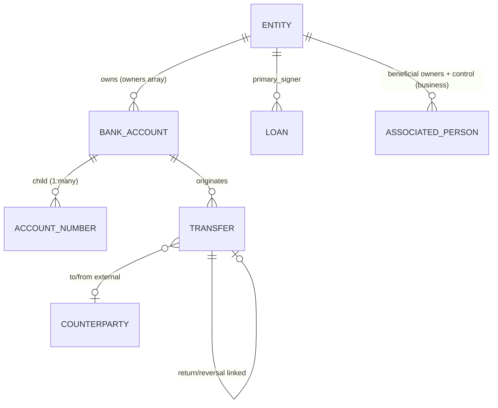
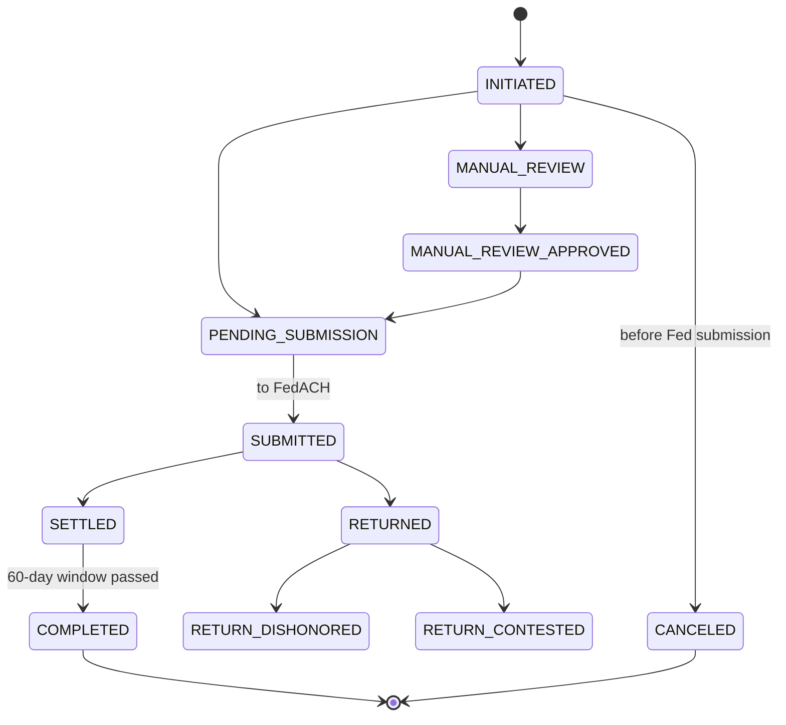

# Column (docs.column.com) API Architectural Analysis for Cassandra

**Provider:** Column N.A. (nationally-chartered bank, **direct Fedwire/FedACH access**) · **Analysis Date:** June 2026 (full-surface confidence pass)
**Sources:** Live `docs.column.com` (`column.com/docs` 301→ here). No OpenAPI spec — all states from live docs.
**Confidence:** ✅ documented+cited · 🔶 inferred · ❓ unclear.

## Entity Model

- ✅ **Entity** `type = PERSON | BUSINESS`; required before any account/loan.
- ✅ **Bank Account** types `CHECKING / OVERDRAFT_RESERVE / PROGRAM_RESERVE / NETWORK_SETTLEMENT_ACCOUNT`; balances `available/pending/holding/locked`.
- ✅ **Joint accounts** = `owners` array (add additional entities). ✅ **Sub/virtual** = multiple **Account Numbers** per one Bank Account.
- ✅ **Beneficial owners** via **associated-persons** endpoints (`is_beneficial_owner`, `is_control_person`). 🔶 `ownership_percentage` referenced in guides, not confirmed in object schema.
- ✅ **Returns/reversals** linked via `return_details[]`, `returned_at`, dishonor/contest sub-states + separate ACH Return / wire return-request objects.

## State Machines (exact strings)
**Entity (KYC/KYB)** ✅ — `verification_status`: `UNVERIFIED → PENDING → MANUAL_REVIEW → VERIFIED | DENIED` (MANUAL_REVIEW carries `review_reasons[]`, resolved via Submit Document). Also `pep_status`.

**ACH Transfer** ✅ (14 states)

(incoming adds `SCHEDULED`, `NSF`; full: `INITIATED, MANUAL_REVIEW, MANUAL_REVIEW_APPROVED, PENDING_SUBMISSION, SUBMITTED, SETTLED, COMPLETED, RETURNED, CANCELED, SCHEDULED, PENDING_RETURN, RETURN_DISHONORED, RETURN_DISHONORED_FUNDS_UNLOCKED, RETURN_CONTESTED`)

**Wire Transfer** ✅ — outgoing `INITIATED → (MANUAL_REVIEW) → COMPLETED | REJECTED`; incoming `COMPLETED` only (credit-only); separate return-request objects.

**Book** ✅ `HOLD/COMPLETED/REJECTED/CANCELED`. **Realtime (RTP/FedNow)** ✅ lowercase `initiated/pending/accepted/completed/blocked/rejected/manual_review…`. **Loan** ✅ `current/delinquent/charged_off/in_dispute/canceled/paid_off`. **Bank Account** ❓ no status enum (open / $0-then-delete).

> ⚠️ **Casing inconsistency** to design around: ACH/Book/Wire/Entity use `UPPER_SNAKE`; **Realtime uses `lower_snake`**.

## Critical Flows
- **ACH origination** ✅: POST (`type` CREDIT|DEBIT, `same_day`, `effective_on`) → `INITIATED` → (`MANUAL_REVIEW`) → `PENDING_SUBMISSION → SUBMITTED → SETTLED → COMPLETED`. Same-day via `same_day=true`; outgoing-debit availability 2 banking days; returns ~2 days admin / **60 days** unauthorized; cancel before Fed submission. ❓ Column's exact cutoff clock times not published (underlying FedACH 10:30/2:45/4:45 PM ET). **Direct FedACH** member.
- **Entity opening** ✅: Person (PII + KYC) `UNVERIFIED→PENDING→VERIFIED`; Business (`ein`, `legal_type`) → **link associated persons** (beneficial owners + control person) → KYB. Going-live needs funded `PROGRAM_RESERVE`.
- **Wire** ✅: POST → `INITIATED → (MANUAL_REVIEW) →` submitted to Fedwire when open (**6:45–9:00 PM ET** queues for next open) → `COMPLETED | REJECTED`. **Direct Fedwire** member.

## Confidence ledger
✅ entity model (joint via owners, beneficial owners, 1:many account numbers), Entity/ACH/Wire/Book/Realtime/Loan state machines with exact strings, ACH & wire flows, event naming. 🔶 ownership_percentage in schema, entity-event member strings. ❓ Bank Account status enum (none), exact Column cutoff times.

## Events / Webhooks
✅ Event = snapshot on each state change; naming `<product>.<resource>.<state>` — e.g. `ach.outgoing_transfer.{initiated,pending_submission,submitted,settled,completed,returned,return_dishonored,canceled,noc}`, `wire.outgoing_transfer.*`, plus `book.*`, `realtime.*`, `entity.*`, `bank_account.*`, `loan.*` families.

## Cross-provider row
| Decision | Column |
|---|---|
| Customer model | Entity (PERSON/BUSINESS); associated-persons for owners |
| Joint accounts | Yes — `owners` array on Bank Account |
| Sub-account model | Multiple Account Numbers per Bank Account (1:many) |
| Transaction linking | `return_details` + ACH Return / wire return-request objects |
| Account states | No status enum (open / $0-then-delete) |
| ACH same-day cutoff | `same_day` flag; exact clock time unpublished (direct FedACH) |
| Ledger exposure | Semi-transparent; direct Fed member; per-rail UPPER_SNAKE states (Realtime lower) |
