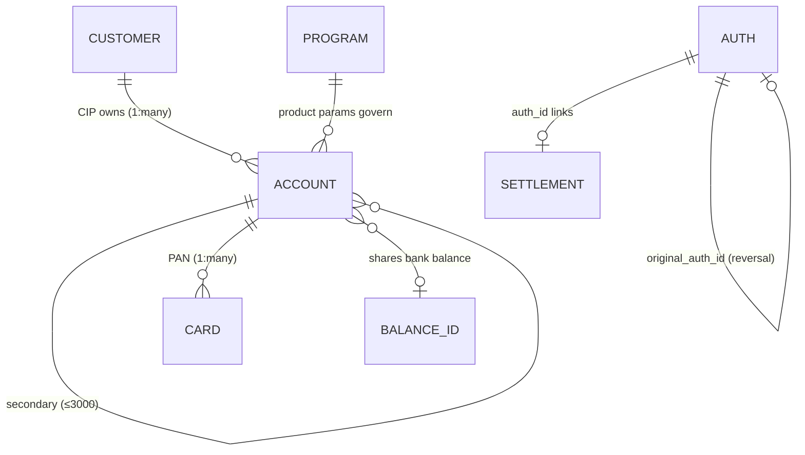
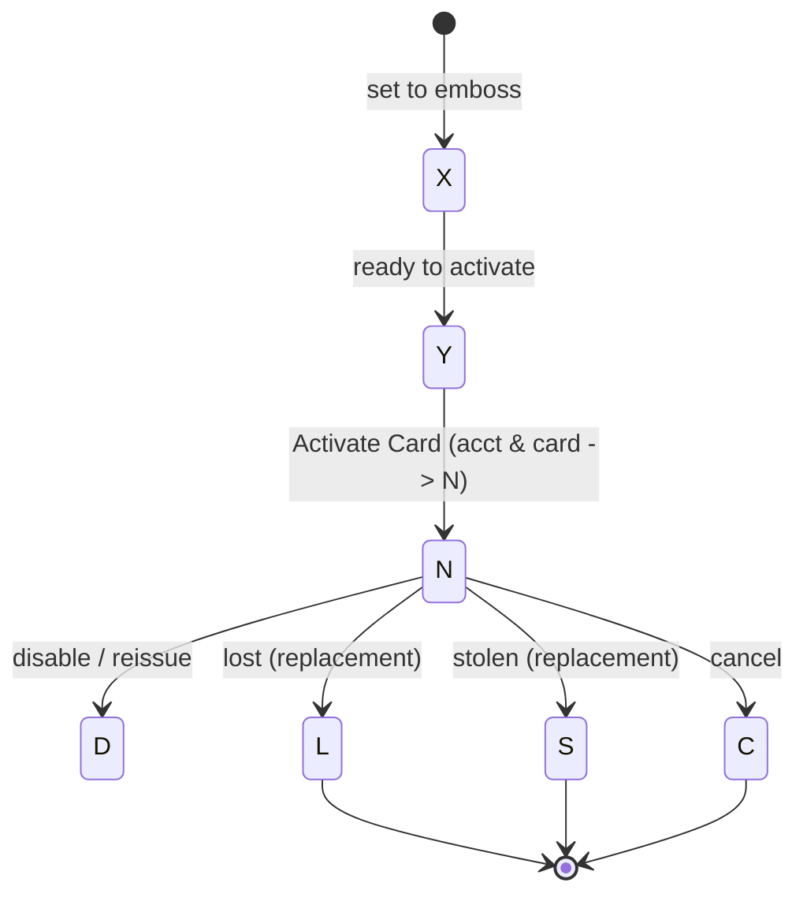

# Galileo (docs.galileo-ft.com/pro) API Architectural Analysis for Cassandra

**Provider:** Galileo Financial Technologies (a **processor**, not a chartered bank) · **Analysis Date:** June 2026 (full-surface confidence pass)
**Sources:** Live public `docs.galileo-ft.com/pro` (status references, Modify-Status-types, Events API). Spec has no component schemas — **states from the live status-reference pages (authoritative)**.
**Confidence:** ✅ documented+cited · 🔶 inferred · ❓ unclear/gated.

> Processor-flavored: **PRN** = account (12-digit), **PAN** = card (16-digit), **CIP** = customer, **RDF** = daily batch extracts, Auth/Settlement chain.

## Entity Model

- ✅ **Primary vs secondary accounts** — secondary = "additional products," up to **3000** per primary.
- 🔶 **Joint accounts** = no first-class object; emulated via secondary accounts sharing one **Balance ID**.
- ✅ Auth→settlement via `auth_id`; original→reversal via `original_auth_id`; ACH return via `ach_trans_id`.
- ❓ **Beneficial owners / KYB** — not a Galileo object; business onboarding reuses account+CIP primitives, UBO collection is the program's responsibility.

## State Machines (exact codes)
**Account status** ✅ — both account AND card must be `N` to transact:
`N` normal · `D` disabled · `K` suspended · `Q` delinquent · `F/P/T/V/W` ID-verification & setup states · `R` charged-off (recover via endpoint) · **`C`/`Z` canceled = permanent** (`response_code 46`) · `M`/`U` moved/upgraded (terminal).

**Card status** ✅ — `N` normal · `Y` ready-to-activate · `X` set-to-emboss · `W` waiting-payment · `D` disabled · `O` ops-hold · `B` blocked · `A` lost-awaiting-funds · `Q` delinquent · `R` charged-off · `V` voided · **`L` lost / `S` stolen / `C` canceled / `Z` canceled-no-refund = permanent**.

**Card lifecycle** ✅

**Customer / CIP (IVS)** ✅ — `Pass · Fail · Refer (manual) · In Progress (docs via SMS)`; CIP runs before/at account open; maps account to F/P/T.

**Authorization** ✅ — `Authorized (hold, otype A/L) → Completed/Settled → Reconciled`; expiry → hold released (`BEXP/BEXR`). Approve `00`, partial `10`, decline `05`.

**Triggers:** the **Modify Status `type`** values are the explicit state levers (e.g. `6` card-activation→N, `10` disable→D, `17/18` freeze/unfreeze, `2/5/13` cancel→C, `24` suspend→K).

## Critical Flows
- **Account creation** ✅: `POST /createaccount` → account in **`W`** → **account-setup cron runs every 5–30 min** (⚠️ not synchronous) → `N`. Integrated IVS returns `Pass/Fail/Refer/In Progress`.
- **Card activation** ✅: physical mails inactive (`X→Y`) → Activate Card (validates CVV/expiry/last-4) → `N`. Virtual/"Digital First" activate at creation.
- **Card authorization** ✅: network → Galileo auth engine decides **in real time** (card `N`? acct `N`? balance? velocity/MCC/3DS) → `response_code`. Optional **Auth API (Authorization Controller)** lets the program **override** the response mid-stream (timeout → `BATO`). Chain: auth hold → completion/settlement → posted → reconciled; force-post if settlement can't match (`original_auth_id=0`).
- **ACH origination** ✅: `POST /createachtransaction` → **Nacha file cut the *following* banking day** (⚠️ next-day batch, not same-day) → ODFI via SFTP. Outgoing debits get a product-configured hold; cancel only before file cut, else file an ACH return. Returns carry codes/NOCs → account adjustment.

## Confidence ledger
✅ entity model, account/card/CIP/auth status codes + Modify-Status triggers, account-creation & card-activation flows, real-time card auth + Auth API override, ACH batch flow, Events API codes. 🔶 joint-account emulation (shared Balance ID), `ACST` account-vs-card code collision. ❓ beneficial-owner/KYB schema (not exposed). ⚠️ heavily **async** (cron setup, next-day ACH); real-time surface is card auth only.

## Events / Webhooks
✅ **Events API** = async webhooks with 4-letter codes: `BAUT:auth` · `SETL:setl` · `AAAU:auth_reversal` · `BEXP/BEXR:auth_exp` · `DAUT:denied_auth` (+ `DNSF/DIAC/DPIN`) · `BATO:Auth_API_timeout` · ACH `BRET/BACR/BADF` · lifecycle `ACST` (acct/card status change), `AACT` activated, `ACLS` closed, `AFRZ/AUNF` freeze.

## Cross-provider row
| Decision | Galileo |
|---|---|
| Customer model | CIP customer → 1:many accounts (PRN) |
| Joint accounts | Emulated — secondary accounts sharing a Balance ID |
| Sub-account model | Secondary accounts (≤3000/primary) |
| Transaction linking | `auth_id` (auth→settle), `original_auth_id` (reversal) |
| Account states | N/D/K/Q/C/Z/R… (alphabetic status codes) |
| ACH same-day cutoff | Next-banking-day Nacha batch (not same-day default) |
| Ledger exposure | Processor ledger; RDF daily batch is reconciliation truth |
