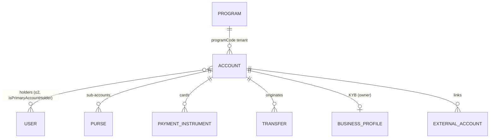
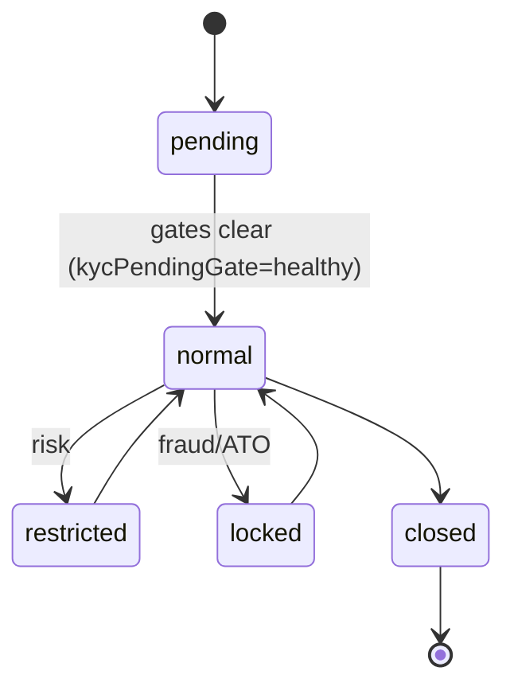

# Green Dot "Arc" (developer.greendot.com) API Architectural Analysis for Cassandra

**Provider:** Green Dot Arc — BaaS platform (Green Dot Bank; signature **cash-load network**) · **Analysis Date:** June 2026 (full-surface confidence pass)
**Sources:** Live **public** docs at `developer.greendot.com/embedded-finance/docs/*` (narrative guides + examples public; consolidated **OpenAPI/Swagger hub is partner-gated ❓**). No spec available to us.
**Confidence:** ✅ documented+cited · 🔶 inferred · ❓ unclear/gated.

> Coverage note: contrary to the assumption that Green Dot's docs are gated, the developer portal is **fully public** (even an `llms.txt` index). Only the canonical machine spec requires onboarding.

## Entity Model

- ✅ **Program** = tenant (`programCode` in every path; configures KYC/OFAC).
- ✅ **Account** types incl. **GPR** and **DDA** (GPR→DDA upgrade flow); **Purse** = sub-account (primary/savings/spend, internal transfers).
- ✅ **Joint accounts** = up to **2 holders**, each own `userIdentifier`+KYC, `isPrimaryAccountHolder` flag. ✅ **Sub-accounts** = purses.
- 🔶 **Business/beneficial owners** = KYB with a single "business profile **owner**" (set/update/delete); full UBO ≥25% graph **not** clearly public ❓.
- 🔶 **Transaction linking** = idempotency `transferIdentifier`; explicit parent/child not surfaced.

## State Machines
**Account / KYC** ✅

- ✅ KYC routing via **`kycPendingGate`**: `healthy / kyc2 / idv / manual / none(declined)`. Status reasons: `verificationNeeded, potentialFraud, confirmedFraud, potentialAccountTakeover, customerInitiatedSpendDown`. Terminal `closed`; recoverable `restricted/locked`.

**Card (Payment Instrument)** ✅ — `notActivated → activated → blocked ⇄ activated → deactivated → closed`; transitions via `PUT .../lifecycleEvent` (`activate/pause/unpause/replace`). Block applies to all non-closed instruments sharing the card number.

**Transfer/Transaction** ✅ — `pending → completed | failed | canceled` (idempotent on `transferIdentifier`; partial purse transfers auto-complete/auto-reverse within 24h).

## Critical Flows
- **Enrollment / account creation** ✅: `POST /enrollments` → **OFAC** → **KYC** (doc IDV via **Socure SDK** when needed) → on pass, card processor creates card (**≤4 retries / 30 min**) → finalize with `POST paymentInstruments`. SSN/ITIN/Foreign-ID supported. Limits ~10 active / 20 lifetime accounts per SSN per program 🔶.
- **Cash load (signature capability)** ✅: **Reload @ the Register** / Card Swipe Reload at ~100k GDN retailers 🔶; **eCash** mobile barcode; processor via **Mastercard rePower**. Surfaced through Barcodes/Store-Locations REST + Retail Consumption (XML) / Point-of-Banking APIs.
- **Transfers** ✅: optional `POST /assessment` precheck → `POST /transfers` → `PUT /transfers/{id}`. Types: ACH (`achOut`/`achPull`), **Instant Funds Transfer** (`iftLoad/iftSend/iftOut`), P2P, Purse (internal), Wire.
- **Card authorization** 🔶: auth + posted txns delivered as **webhook events**; a synchronous partner approve/decline-at-auth API is **not clearly public** ❓ (notification, not decisioning).

## Confidence ledger
✅ entity model (purses, joint holders, program tenant), Account/KYC + Card + Transfer state machines, enrollment/cash-load/transfer flows, webhook model. 🔶 account/card limit figures (program-configurable), UBO modeling, transaction linking. ❓ synchronous card-auth decisioning, full OpenAPI spec (gated).

## Events / Webhooks
✅ HTTPS POST per event type; categories: transaction authorizations & posted txns, account/user status, card ordering/replacement, ACH/P2P/direct-deposit, interest/bill-pay/adjustments, statement-ready. PCI data + full SSN excluded (last-4 + BIN only). Retry hourly up to 24h; partner returns 200/201.

## Notable for Cassandra
- Validates **purses ≈ sub-accounts**, **program = tenant**, gate-based KYC (`kycPendingGate` as a single routable field — maps to "controls as gates" / `compliance_floor` OFAC), and the **`lifecycleEvent` verb endpoint** for card transitions.
- **Weak** reference for business/UBO modeling (single business-profile owner) — Cassandra's unified `/entities` is more expressive.

## Cross-provider row
| Decision | Green Dot Arc |
|---|---|
| Customer model | User/Customer under Program tenant; KYB single business owner |
| Joint accounts | Yes — up to 2 holders (`isPrimaryAccountHolder`) |
| Sub-account model | Yes — Purses (primary/savings/spend) |
| Transaction linking | `transferIdentifier` idempotency (no explicit parent/child) |
| Account states | pending/normal/restricted/locked/closed (+ kycPendingGate) |
| ACH same-day cutoff | ❓ not published; ACH + Instant Funds Transfer + cash-load network |
| Ledger exposure | Abstracted; purse-based; cash-load network is the differentiator |
