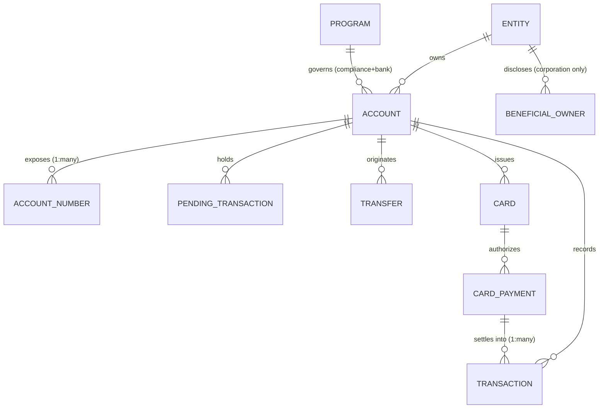
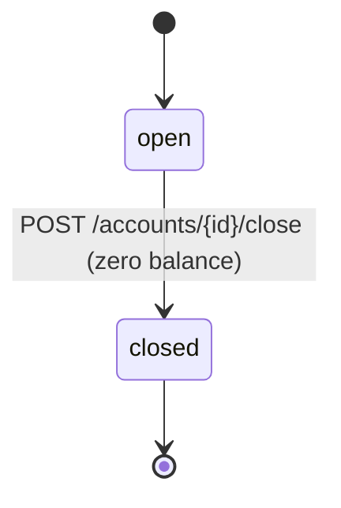
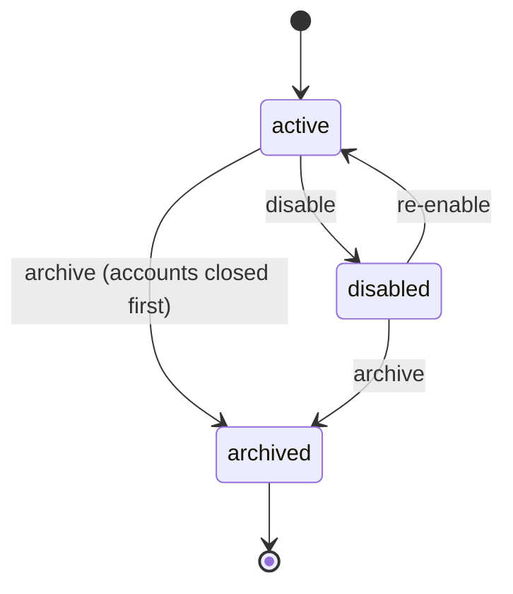
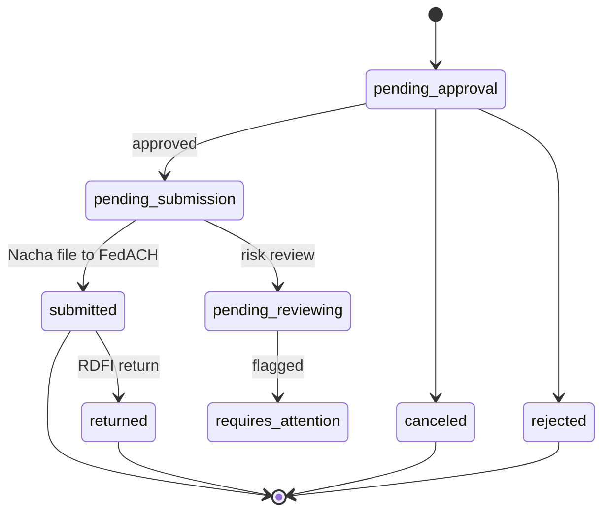
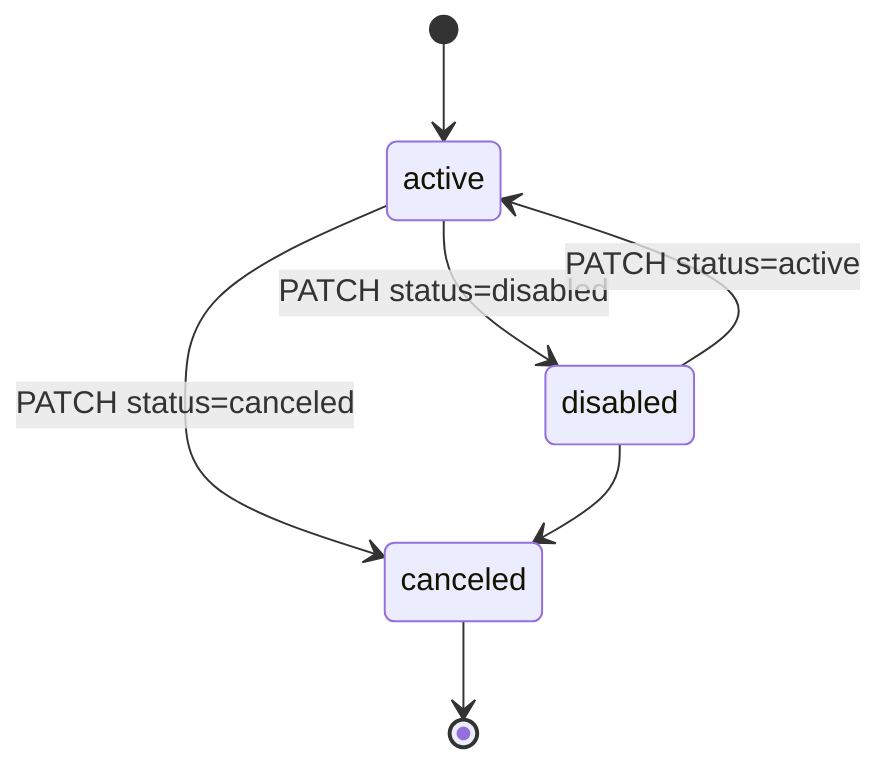
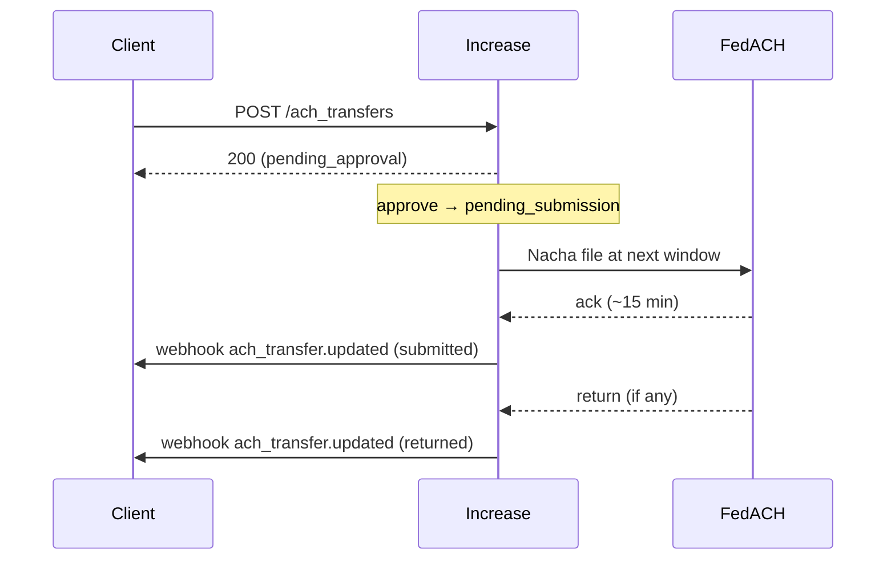
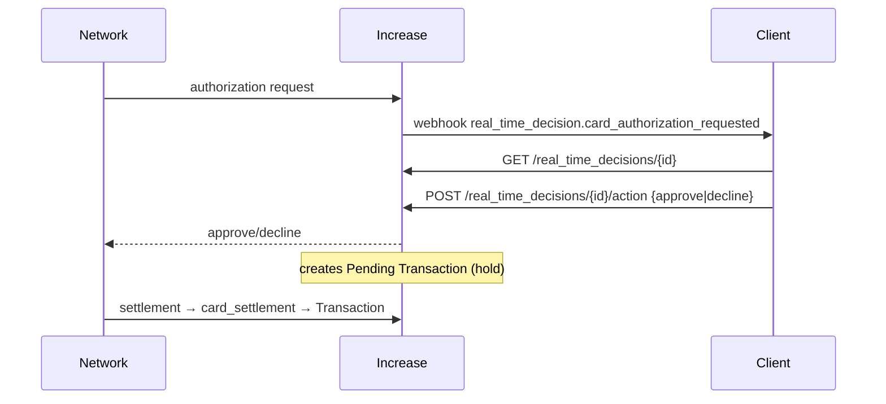
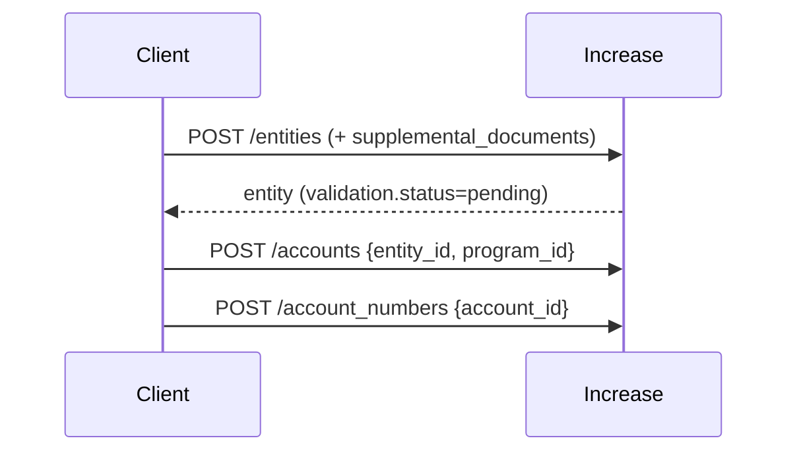

# Increase API Architectural Analysis for Cassandra

**Provider:** Increase
**Analysis Date:** June 2026 (pipeline reproduction — full-surface confidence pass)
**Sources:** Live documentation (increase.com/documentation/*) read across money-movement, cards, entities/accounts/programs, and events; cross-checked against the local OpenAPI spec (`increase/openapi.json` — 176 endpoints, 209 schemas). State enums are spec-authoritative ✅.
**Confidence legend:** ✅ documented explicitly · 🔶 inferred · ❓ unclear/not found.

> Surface covered: **40+ stateful objects** and **104 webhook event categories** (full spec enum). This summary keeps the rubric's focus (entity model, the four state machines, three critical flows) but every claim is now graded and citation-backed.

---

## Entity Model

**Key design decisions**
- ✅ **Entity ≠ Account.** `Entity.structure ∈ {natural_person, corporation, joint, trust, government_authority}`. Every Account binds one `entity_id` + one `program_id`.
- ✅ **Account ↔ Account Number is 1:many.** Account = "bucket of funds," Account Number = "pointer." Virtual/sub-accounts are minted as many Account Numbers (each can individually allow/deny ACH debits) — *not* nested accounts. (Mirrors Cassandra D2.)
- ✅ **Transactions vs Transfers split.** `Transfer` = instructed movement; `Transaction` = settled ledger event; `PendingTransaction` = pre-settlement hold; `DeclinedTransaction` = rejected.
- ✅ **Program** determines compliance + commercial terms and the sponsor `bank` (Core/First Internet/Grasshopper/Twin City). Every Account needs one. (Direct analog to Cassandra's program concept.)
- ✅ **Joint accounts** = `Entity.structure = joint` (info on each person), not a multi-owner flag on Account.
- ✅ **Beneficial owners** (corporation only): exactly 1 control-prong + up to 4 ownership-prong (≥25%) → **≤5 total**, via dedicated beneficial-owner APIs.
- ✅ **Card Payment → many Transactions**: one payment can produce multiple `card_settlement`s (split shipments), each its own Transaction.

**Notable:** Increase is deliberately *semi-transparent* — it exposes Fed mechanics (FedACH windows, file status, Check 21) rather than abstracting them. Matches Cassandra D8.

---

## State Machines

**Account** — `open → closed` (✅ zero-balance required to close; `closed` terminal)

**Entity** — `active ⇄ disabled → archived` (✅ 3 states; archive requires accounts closed first). **KYC is a *separate* axis**: `validation.status ∈ {pending, valid, invalid}` with `validation.issues[]` — Increase has **no `PENDING` entity state** (⚠️ differs from Cassandra's 4-state `PENDING→ACTIVE↔DISABLED→ARCHIVED`).

**ACH Transfer** — 9 states ✅

**Card** — `active ⇄ disabled → canceled` (✅ client-initiated via `PATCH /cards/{id}` `status`; `canceled` terminal). No automatic/system state machine 🔶.

| Object | Terminal | Recoverable | Notes |
|---|---|---|---|
| Account | closed | no | zero-balance to close ✅ |
| Entity | archived | disabled→active ✅ | KYC separate (`validation.status`) ✅ |
| ACH Transfer | returned/canceled/rejected | requires_attention→resolvable ✅ | |
| Card | canceled | disabled→active ✅ | client-driven via PATCH ✅ |

*Other stateful rails (spec ✅, same `pending_*→submitted→complete/returned` shape):* wire_transfer (9), check_transfer (10, incl. `mailed`/`stopped`/`deposited`), real_time_payments_transfer (8), check_deposit, inbound_* variants, card_payment elements, real_time_decision (`pending/responded/timed_out`).

---

## Critical Flows

**1. ACH origination** (credit) — ✅ timing

- ✅ **Same-day:** amount **< $1,000,000**, submit **before 4:45 PM ET**; same-day is the default. FedACH runs **3 same-day + 6 future-dated** windows; submit ~1 hr before a window to guarantee inclusion. Funds availability 1–2 days.
- ✅ **Returns:** 2 business days (non-consumer) / 60 days (consumer); reversals = a second ACH Reversal entry; **NOC** updates future transfers.
- ✅ **ACH debit:** requires authorization + account verification (Plaid/Yodlee/MX/Finicity/Teller or microdeposits, 1–2 days); proof-of-authorization SLA 5 banking days; auth retained ≥2 yrs. Exact debit cutoff times ❓ (inherit FedACH 4:45 PM ET 🔶).
- ✅ External: Federal Reserve / FedACH (Nacha files over SFTP). Events: `ach_transfer.created/.updated`, `inbound_ach_transfer.*`.

**2. Card authorization** (real-time decisioning) — ✅ now fully documented

- ✅ **SLA:** respond in **2–4 s**; on timeout/crash Increase **auto-declines** (`timeout_at` provided; RTD state → `timed_out`).
- ✅ **Card Payment lifecycle:** authorization (hold = Pending Transaction) → optional `card_increment`/`card_reversal`/`card_authorization_expiration` → `card_settlement` (creates Transaction). `state` object tracks authorized/incremented/reversed/refunded/settled amounts. Declines = `card_decline` element with `actioner` (increase/network/user).
- ✅ **Digital wallets** (Apple/Google/Samsung) + **3DS** also go through real-time decisions (`digital_wallet_token_requested`, `card_authentication_requested`). Events: `card_payment.*`, `real_time_decision.*`.

**3. Account opening** — ✅ order confirmed

- ✅ Individual vs business differs **only at the Entity step**: `natural_person` (PII only) vs `corporation` (business details + beneficial owners). Account/Account-Number steps identical.

---

## Confidence ledger (this pass)

| Area | Pilot | After full-surface pass |
|---|---|---|
| Entity/Account/Program model | ✅ | ✅ (+ Program, beneficial-owner cardinality, validation axis) |
| Four state machines | ✅ states, 🔶 transitions | ✅ all four + corrected Entity 3-state |
| ACH timing & returns | ✅ partial | ✅ (windows, cutoffs, NOC, debit verification) |
| **Card auth flow** | 🔶 (page 404'd) | ✅ full (2–4 s SLA, timeout-decline, payment lifecycle) |
| Wire / Check / RTP | (not covered) | ✅ flows + timing (Fedwire 9pm–7pm ET, RTP $10M, irrevocable) |
| Events / webhooks | (not covered) | ✅ single Event obj, 104 categories, HMAC-SHA256, 8 retries/72h |
| Account opening (biz vs individual) | 🔶 | ✅ |

**Residual ❓ (small):** exact ACH-debit cutoff times; check-deposit funds-availability hold schedule; FedNow-specific cutoffs (folded into RTP); physical-card ordering specifics (`/api/physical-cards` not fetched). All narrow and individually fetchable.

## Cross-provider row (for synthesis)
| Decision Point | Increase |
|---|---|
| Customer model | Split via `Entity.structure` (natural_person/corporation/joint/trust/gov); KYC on separate `validation.status` |
| Joint account support | Yes — `Entity.structure = joint` |
| Sub-account model | Account Numbers 1:many per Account (per-number ACH-debit toggle) |
| Transaction linking | Transfer-type return/reversal objects; Card Payment groups auth→settlement |
| Account states | open, closed (zero-balance to close) |
| ACH same-day cutoff | 4:45 PM ET, < $1M, same-day default |
| Ledger exposure | Semi-transparent (Transactions vs Transfers; Fed mechanics exposed; optional bookkeeping_* GL) |
