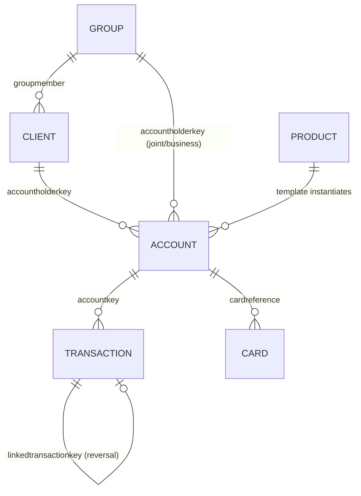
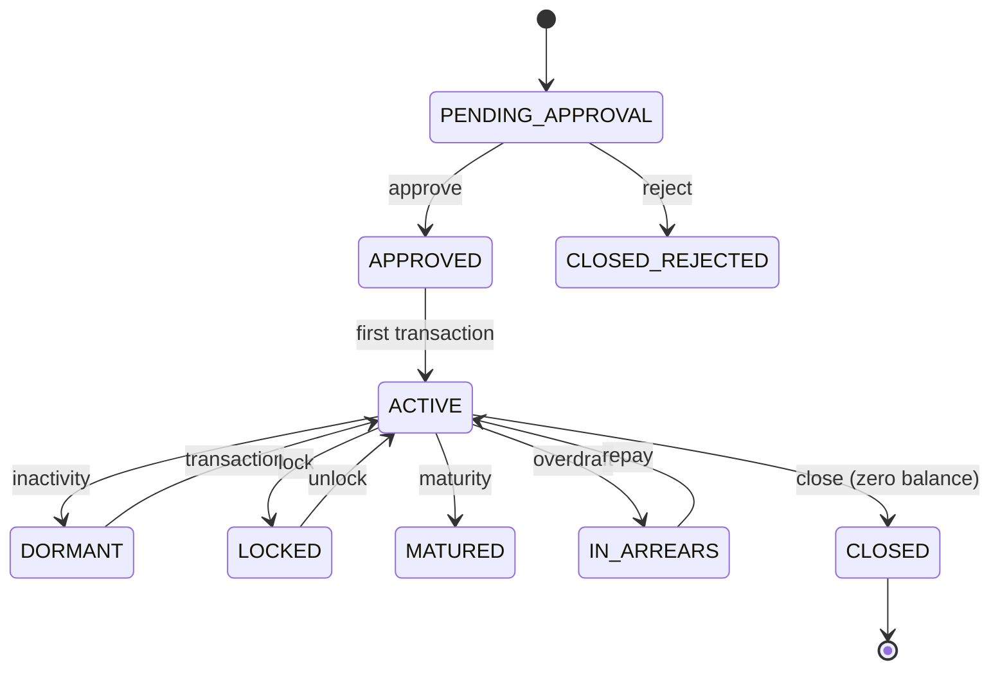

# Mambu (docs.mambu.com) API Architectural Analysis for Cassandra

**Provider:** Mambu — cloud **core-banking / loan-management SaaS** (a ledger of record, **not Fed-connected**) · **Analysis Date:** June 2026 (full-surface confidence pass)
**Sources:** Live `docs.mambu.com` life-cycle pages + data dictionary. No OpenAPI spec — states from life-cycle docs. Some overview pages are JS-gated (❓).
**Confidence:** ✅ documented+cited · 🔶 inferred · ❓ unclear/gated.

## Entity Model

- ✅ **Client** (individual) vs **Group** (collective/joint/business). An account's `accountholderkey` references **exactly one** Client OR Group.
- ✅ **Joint accounts = a Group** ("Joint Account" group type with role names: main/secondary signatory), if the product is group-enabled.
- ✅ **Account = instance of a Product** (Deposit/Loan Product template supplies interest method, fees, rules).
- 🔶 **No sub-account / 1-account-to-many-numbers model** (unlike Cassandra); related accounts group under a **Credit Arrangement** (line of credit).
- ✅ **Transaction linking** via `linkedtransactionkey` + transaction `type` (DISBURSEMENT/REPAYMENT/REVERSAL).

## State Machines (exact strings)
**Client** ✅ — `PENDING_APPROVAL → INACTIVE ⇄ ACTIVE`; plus `REJECTED`, `EXITED`, `BLACKLISTED`. `ACTIVE` requires ≥1 active account, **auto-reverts to `INACTIVE`** when none remain. All states reversible via "undo" (none strictly terminal 🔶).

**Deposit Account** ✅

**Loan Account** ✅ — `PARTIAL_APPLICATION → PENDING_APPROVAL → APPROVED → ACTIVE ⇄ ACTIVE_IN_ARREARS`; `LOCKED`; terminal closes `CLOSED_PAID_OFF / CLOSED_WRITTEN_OFF / CLOSED_REJECTED / CLOSED_WITHDRAWN / CLOSED_RESCHEDULED / CLOSED_REFINANCED`, plus `TERMINATED`.

**Card** ❓ — no formal card *account* state machine; surfaces as **authorization-hold events** (created → settled/reversed/expired).

| Object | Pattern | Terminal |
|---|---|---|
| Client | create→approve→activate (auto INACTIVE when no accounts) | none (all reversible) |
| Deposit Account | PENDING_APPROVAL→APPROVED→ACTIVE | CLOSED_* (reopenable) |
| Loan Account | PARTIAL_APPLICATION→…→ACTIVE | CLOSED_PAID_OFF / WRITTEN_OFF |

## Critical Flows
- **Account opening (universal `create → approve → activate`)** ✅: initial state + approval requirement configurable via Internal Controls / product. Deposit: PENDING_APPROVAL→APPROVED→(first txn)→ACTIVE. Loan: PARTIAL_APPLICATION/PENDING_APPROVAL→APPROVED→(disburse)→ACTIVE.
- **Loan disbursement → repayment** ✅: from `APPROVED`, disburse → DISBURSEMENT txn → `ACTIVE`; funds via external channel **or** booked into the client's deposit account. Repayment allocated to schedule; arrears cleared `ACTIVE_IN_ARREARS→ACTIVE`; payoff → `CLOSED_*`.
- **No Fed/ACH rail** ✅ — Mambu journals movement; settlement is the integrator's responsibility.

## Confidence ledger
✅ entity model (Client/Group/Product), Client/Deposit/Loan state machines with strings, opening + disbursement/repayment flows, events. 🔶 some `CLOSED_*` variant strings (UI vs enum), no-Fed framing. ❓ JS-gated group/webhook overview pages, Card state machine.

## Events / Webhooks
✅ Two models: **Webhooks** (push, notification templates on event triggers, exponential-backoff retry, 2xx=success) and **Streaming API** (pull, replayable, `event_types[]`). Triggers: `CLIENT_*`, `SAVINGS_*` (CREATED/APPROVAL/ACTIVATED/DEPOSIT/WITHDRAWAL/CLOSURE), `LOAN_*` (CREATED/APPROVAL/DISBURSEMENT/REPAYMENT/WRITE_OFF), `CARDS_AUTHORISATION_HOLD_*`, `ACCOUNT_IN_ARREARS`. Events **report** transitions; they don't drive the internal state machine.

## Cross-provider row
| Decision | Mambu |
|---|---|
| Customer model | Client (individual) vs Group (joint/business) |
| Joint accounts | Yes — a Group is the account holder |
| Sub-account model | None (Credit Arrangement for lines of credit) |
| Transaction linking | `linkedtransactionkey` + txn type |
| Account states | Rich lifecycle (PENDING_APPROVAL→APPROVED→ACTIVE→DORMANT/LOCKED/MATURED/IN_ARREARS→CLOSED_*) |
| ACH same-day cutoff | N/A — no Fed rail (core/LMS only) |
| Ledger exposure | Explicit core/LMS ledger; approval-gated lifecycle; product-as-template |
