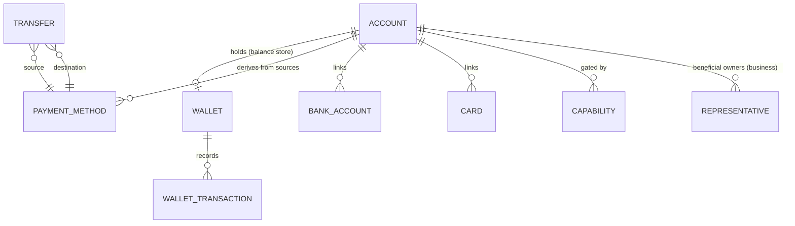
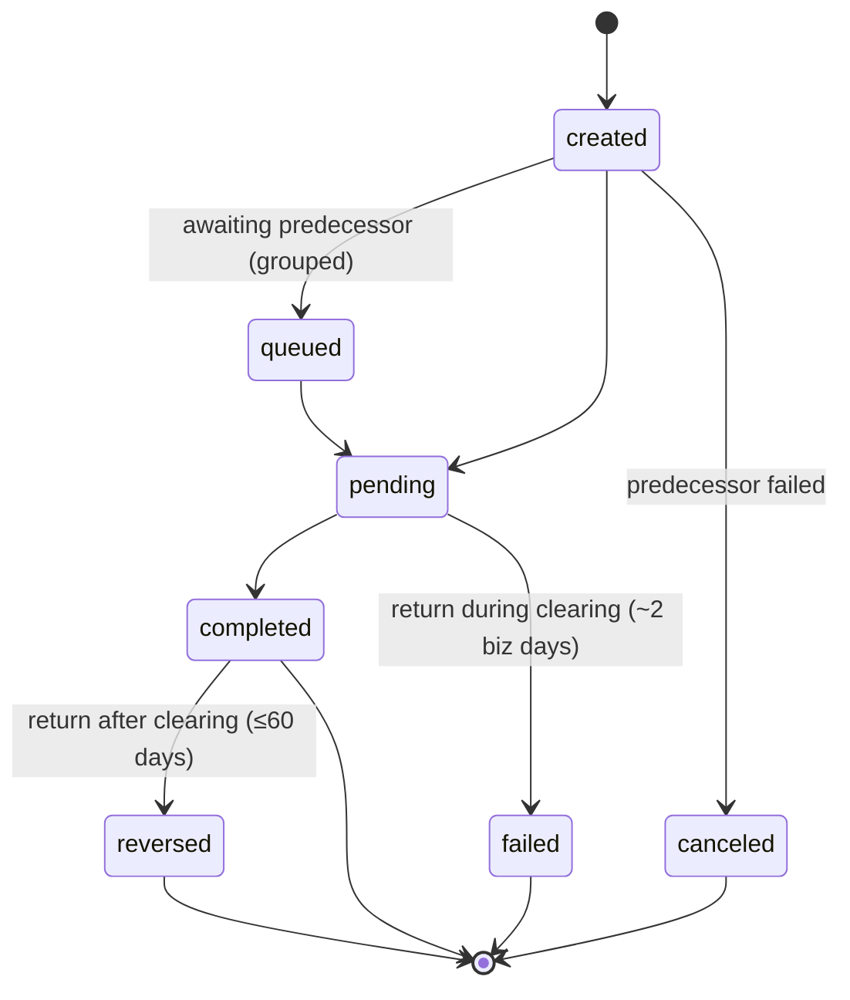

# Moov (docs.moov.io) API Architectural Analysis for Cassandra

**Provider:** Moov · **Analysis Date:** June 2026 (full-surface confidence pass)
**Sources:** Live docs.moov.io + OpenAPI spec (601 schemas — states spec-authoritative ✅).
**Confidence:** ✅ documented+cited · 🔶 inferred · ❓ unclear.

> **Defining trait: wallet-as-ledger-hub.** Nearly every transfer/card/ACH event resolves to a **Wallet transaction**; the Wallet (not the Account) is the balance-bearing primitive.

## Entity Model

- ✅ **Account roles:** Facilitator (yours, hidden), Business, Individual (your end-users via Hosted Onboarding / Drop / API).
- ✅ **Wallet** is the only **bidirectional** payment method; external funds (bank/card) land in a wallet then disburse out. "For each transfer, a corresponding wallet transaction is created."
- ✅ **Beneficial owners** = `representative.*` (business accounts requesting payment capabilities). ❓ **No joint/sub-account primitive** — multi-party isolation = separate accounts each owning a wallet.
- ✅ **Capability** is the compliance gate (verification = KYC/KYB; underwriting = risk/volume) before any rail unlocks.

## State Machines (spec ✅, triggers from docs)
**Transfer** ✅

**IssuedCardAuthorization** ✅ — `pending (wallet hold) → cleared`; `declined | canceled | expired` release the hold (all terminal). Wallet correspondence: `issuing-auth-hold → issuing-auth-release → issuing-transaction`.

**Wallet** ✅ `active → closed`. **WalletTransaction** `pending → completed | canceled | failed`. **Capability** ✅ `pending → in-review → enabled` (or `disabled`). **BankAccount** `new/pending → verified | verificationFailed | errored` (✅ can credit unverified; must verify to debit).

| Object | Terminal | Trigger highlights |
|---|---|---|
| Transfer | completed/failed/reversed/canceled | return timing (clearing vs ≤60d) |
| IssuedCardAuth | cleared/declined/canceled/expired | merchant capture vs reversal/expiry |
| Capability | enabled/disabled | Moov compliance review |
| BankAccount | verified/errored | micro-deposit/Plaid/MX; ACH returns |

## Critical Flows
- **ACH origination** ✅: standard cutoff **4:15 PM ET**; debit funds **held 2 banking days** to absorb returns. **Faster ACH** (risk-approved, `no-hold`): bank→wallet 4:15 PM ET, bank→bank 2:15 PM ET, completes ≤1 day (eligibility: 90+ days, ≥$50K/mo, returns <0.5%). Returns auto-reversed through the wallet; codes R02/R04/R05/R07/R10 → account intervention.
- **Onboarding + capabilities** ✅: create account → request capability → verification (KYC; KYB+beneficial owners for business) + underwriting → `pending→in-review→enabled`. 🔶 No published underwriting SLA.
- **Card acquiring/issuing (wallet hop)** ✅: acquiring `initiated→confirmed→settled→ merchant wallet credited ~1 PM ET → completed`; issuing places `issuing-auth-hold` on the wallet → clearing → `issuing-transaction` debit.

## Confidence ledger
✅ wallet-centric model, Transfer/IssuedCardAuth/Capability/BankAccount states, ACH cutoffs+holds+returns, onboarding/underwriting, card acquiring/issuing wallet hop, webhook catalog. 🔶 BankAccount sub-state definitions (sub-pages not fetched), issuing-auth events surface via `walletTransaction.updated`. ❓ joint/sub-account (none found), auth hold-expiration window, underwriting SLA.

## Cross-provider row
| Decision | Moov |
|---|---|
| Customer model | Account roles (Facilitator/Business/Individual) |
| Joint accounts | None — separate accounts, each with a wallet |
| Sub-account model | None — wallet-per-account |
| Transaction linking | Every transfer → wallet transaction; achDetails/cardDetails sub-status |
| Account/wallet states | Wallet active/closed; Transfer 7-state |
| ACH same-day cutoff | 4:15 PM ET standard; 2:15 PM ET bank→bank faster |
| Ledger exposure | Explicit — Wallet IS the ledger; every event is a wallet txn |
