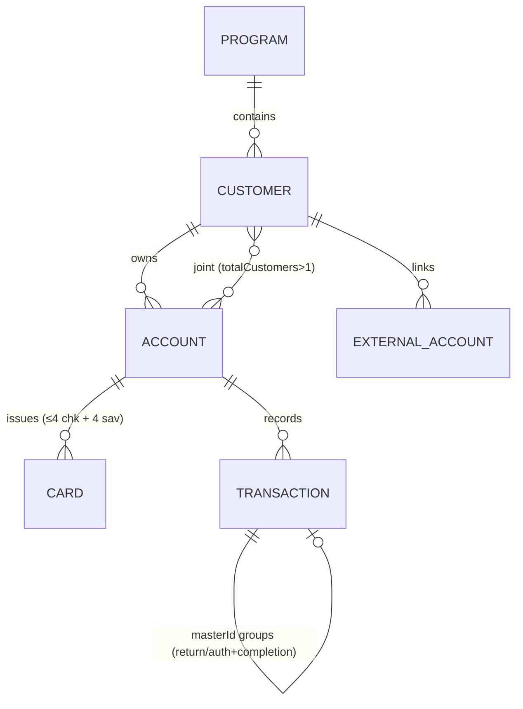
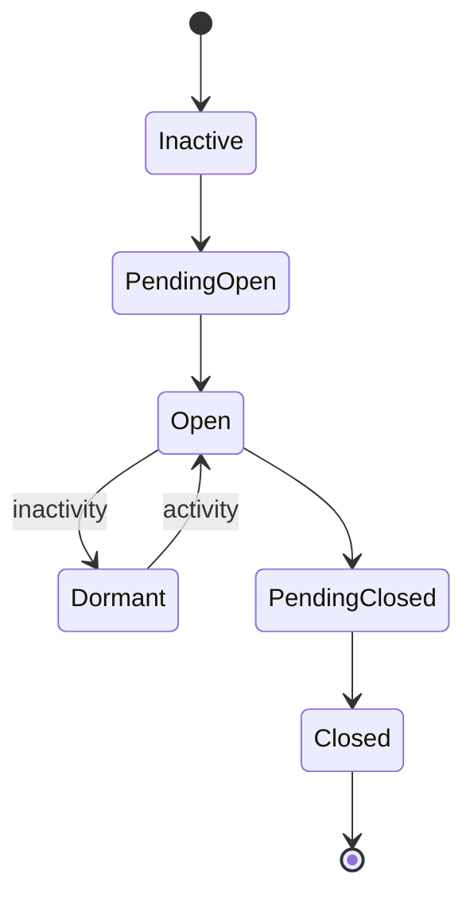

# Q2 Helix (docs.helix.q2.com, formerly CorePro/Cambr) Architectural Analysis for Cassandra

**Provider:** Q2 Helix — "cloud-based real-time bank core for embedded white-labeled products" · **Analysis Date:** June 2026 (full-surface confidence pass)
**Sources:** Live public `docs.helix.q2.com` object/reference pages. Spec lacks status enums — **states from live docs (authoritative)**.
**Confidence:** ✅ documented+cited · 🔶 inferred · ❓ unclear/gated.

## Entity Model

- ✅ **Program** = top-level container (limits, products, partner bank, BINs); read-only via API.
- ✅ **Customer** (`isBusiness` flag); **Account** types `Checking/Savings/Prepaid/ForBenefitOf`.
- ✅ **Joint accounts:** `isJointAccount`, `customerPriority`, `totalCustomers`, `primaryCustomerId` (requires bank-partner approval).
- ✅ **Transaction linking** via **`masterId`** (groups ACH withdrawal+return, debit auth+completion, check deposit+return); returns carry NACHA `returnCode`.
- 🔶/❓ **Beneficial owners**: `CustomerBeneficiary` is a death-benefit payee (not UBO); a **CDD** object + `isExemptFromBeneficialOwnership` exist, but the UBO-collection model is not publicly documented. 🔶 No standalone `AccountType` object — it's `Account.type` + a `Product` (`productId`).

## State Machines (exact status strings)
**Customer** ✅ — `Initiated, Manual Review, Verified, Active, Denied, Expired, Archived, Deceased`, plus **separate compliance axes**: `kycStatus`, `kybStatus` (business), `ofacStatus`, `fraudStatus`. Terminal: Denied/Archived/Deceased.

**Account** ✅

`Closed` is **terminal** (cannot reopen). Lock is **orthogonal**: `lockTypeCode` (UNL/CST/SYS — SYS not API-unlockable) + `lockReasonTypeCode` (FRD/ADM/FRZ/SUS/…).

**Transaction** ✅ — exactly 4 statuses: `Initiated → Pending (in NACHA file) → Settled`, or `Voided` (before NACHA delivery). Other behaviors are transaction *types* grouped by `masterId`, not statuses.

**Card** ✅ — `Initiated, Pending, PendingVerification, Verified, Denied, Expired, Archived, Reissued, HotListed, …` (digital activates immediately; physical → verify, 3 attempts → `Denied`; HotListed = lost/stolen lock).

**ExternalAccount** ✅ — `Unverified → VerifyLocked → Verified | Denied | Expired | Archived`.

## Critical Flows
- **ACH origination** ✅: Helix as ODFI settles **next business day** if before bank cutoff (Fri→Mon); **same-day for a fee**; **internal Helix-to-Helix is immediate** (bypasses ACH). Void while `Initiated`/`Pending` (pre-NACHA). Returns link via `masterId` + `returnCode`. Common gate: customer `Verified` ~10 business days before withdrawing. ❓ exact cutoff *times* are bank-of-record defined.
- **Account opening + CIP** ✅: `/customer/create` (`isBusiness` for KYB) → KYC/OFAC/fraud → `status`/`kycStatus` of Verified/Manual Review/Denied → `/account/create` with `productId` → `PendingOpen → Open`. ExternalAccount via micro-deposits.
- **Card issuance/authorization** ✅: `/card/initiate` → (digital active immediately / physical mailed) → `/card/verify`. Auth (event `403`) places a **72h fund hold** (if no settlement date) → completion settles (often instantly) linked via `masterId`; reversals (`503`) instant; declines (`410`). Optional real-time **In-Auth decisioning** lets the client approve/decline.

## Confidence ledger
✅ entity model + joint accounts, all four state machines with exact strings + orthogonal lock model, ACH timing/void/returns, account-opening+CIP, card issuance/auth + event IDs. 🔶 webhook delivery (webhooks vs Azure Service Bus), AccountType-via-Product. ❓ UBO/KYB collection model, exact ACH cutoff times.

## Events / Webhooks
✅ Events identified by numeric **`payloadTypeId`**: Customer-Account Deposit `200`/Transfer `201`/Withdrawal `202`/**Transaction Modified `203`**/**Account Modified `204`**; Debit-Card Auth **`403`**/Declined **`410`**/Reversals **`500`–`503`**; Card Modified `1200`; Account Dormancy `1400`; Stop Payments `800`. 🔶 Delivery via webhooks and/or Azure Service Bus.

## Cross-provider row
| Decision | Q2 Helix |
|---|---|
| Customer model | Customer (`isBusiness`); compliance on separate kyc/kyb/ofac/fraud axes |
| Joint accounts | Yes — `isJointAccount`/`customerPriority` (bank approval) |
| Sub-account model | `ForBenefitOf` type + customer-scoped accounts (no explicit sub-account) |
| Transaction linking | `masterId` groups related txns |
| Account states | Inactive/PendingOpen/Open/Dormant/PendingClosed/Closed (+ orthogonal lock) |
| ACH same-day cutoff | Next-business-day (same-day for fee); internal immediate |
| Ledger exposure | Real-time core; Transaction 4-state; types grouped by masterId |
