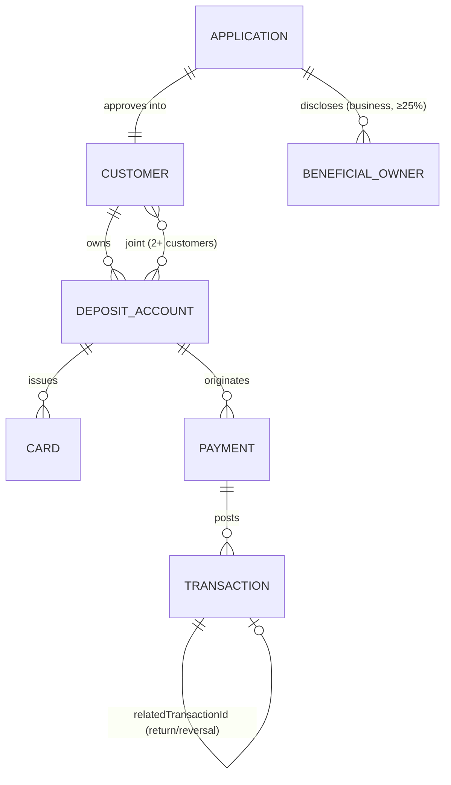
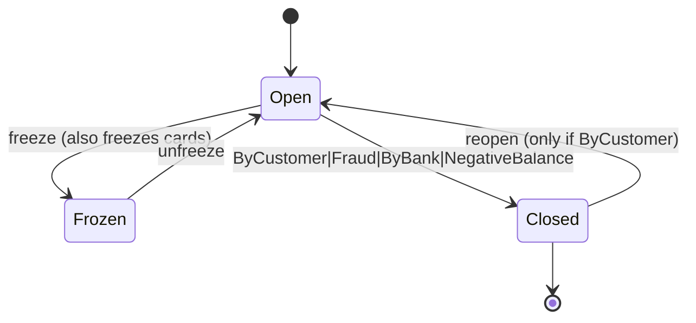

# Unit (unit.co) API Architectural Analysis for Cassandra

**Provider:** Unit · **Analysis Date:** June 2026 (full-surface confidence pass)
**Sources:** Live docs `unit.co/docs/api/*` (canonical; `docs.unit.co/*` 301-redirects here). Unit's OpenAPI ships no component schemas, so **all state machines are from live docs**.
**Confidence:** ✅ documented+cited · 🔶 inferred · ❓ unclear.

## Entity Model

- ✅ **Customer is not directly creatable** — only an **approved Application** mints one (`IndividualCustomer` / `BusinessCustomer` / `BusinessWalletCustomer`).
- ✅ **Joint accounts:** a Deposit Account can serve "an array of two or more Customers" (≥1 over 18).
- ✅ **Beneficial owners** on `BusinessApplication` (all ≥25% owners) + a required **Officer**; ✅ **Authorized Users** for business customers.
- ✅ **Transaction** is immutable; reversals/returns/disputes link via `relatedTransactionId`. 🔶 Sub/virtual accounts = separate **Wallets** product, not a generic sub-account.

## State Machines
**Application (KYC)** ✅ — `Pending → AwaitingDocuments → PendingReview → Approved | Denied | Canceled` (Approved→creates Customer; most approve <5s; PendingReview ~2 business-hr SLA).

**Deposit Account** ✅

**Payment (ACH)** ✅ — `Pending → PendingReview → Clearing(debit only) → Sent` ; terminal `Sent`/`Returned`/`Rejected`/`Canceled`. `Rejected` = pre-network (NSF/limit); `Returned` = RDFI; `Sent` = final success.

**Card** ✅ — states `Inactive, Active, Frozen, Stolen, Lost, ClosedByCustomer, SuspectedFraud`. `Active⇄Frozen`; **terminal** `Stolen/Lost/ClosedByCustomer`; `SuspectedFraud` auto-opens a Fraud Case. Declined whenever status ≠ Active.

| Object | Terminal | Recoverable |
|---|---|---|
| Application | Approved/Denied/Canceled | AwaitingDocuments, PendingReview |
| Deposit Account | Closed (non-ByCustomer) | Frozen→Open; Closed(ByCustomer)→reopen |
| Payment | Sent/Returned/Rejected/Canceled | PendingReview→Clearing |
| Card | Stolen/Lost/ClosedByCustomer | Frozen→Active |

## Critical Flows
- **ACH origination** ✅: Credit debits originating account immediately → `Sent`; Debit path `Pending→Clearing→posted` (funds in several business days). Cutoff **~4:15 PM ET (varies by bank)**; **same-day supported but disabled by default**. Over daily limit → `Rejected`; over soft limit → `PendingReview`. Returns → `payment.returned` + linked `Returned ACH` txn.
- **Account opening** ✅: Individual = `IndividualApplication` → async KYC → `Approved` → Customer → create Deposit Account. Business = `BusinessApplication` (**Officer + beneficial owners**) → KYB, more likely `PendingReview`.
- **Card authorization** 🔶/✅: network auth → Unit optionally relays an **Authorization Request** to partner for real-time approve/decline (`authorizationRequest.approved|declined`); decline-reason enum documented (`InsufficientFunds`, `DoNotHonor`, `RestrictedCard`, …). ❓ timeout/partial-approval behavior (page 404'd).

## Confidence ledger
✅ entity model (joint, beneficial owners), all four state machines, ACH flow/cutoff/returns, account-opening biz vs individual, full event catalog. 🔶 sub-account/Wallets model, auth-request internals. ❓ account-number↔account cardinality, payment→transaction field name, card-auth timeout/partial-approval.

## Cross-provider row
| Decision | Unit |
|---|---|
| Customer model | Application→Customer (Individual/Business/BusinessWallet); not directly creatable |
| Joint accounts | Yes — array of 2+ Customers on a Deposit Account |
| Sub-account model | Separate Wallets product (no generic sub-account) |
| Transaction linking | `relatedTransactionId` (reversal/return/dispute) |
| Account states | Open, Frozen, Closed (reason-coded; ByCustomer reopenable) |
| ACH same-day cutoff | ~4:15 PM ET (bank-varying); same-day off by default |
| Ledger exposure | Semi-abstract; immutable Transactions; Payment vs Transaction split |
