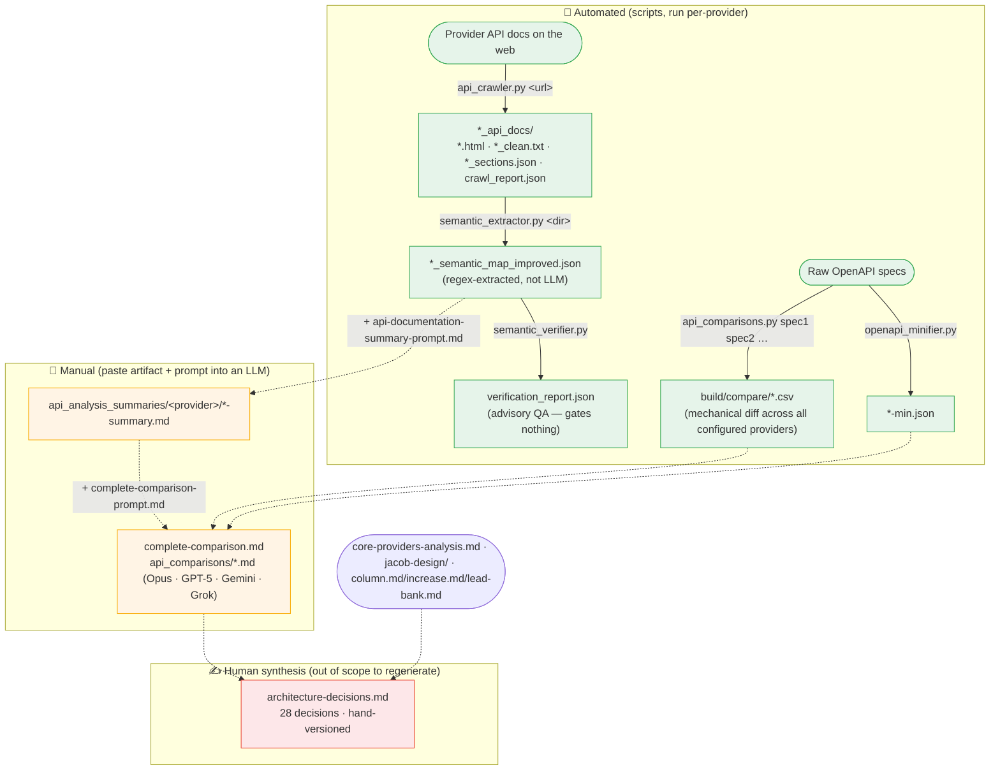

# Research Pipeline

How competitor BaaS/banking APIs are crawled, normalized, and compared to **inform** the
architecture decision log. The pipeline is **automated up to the JSON/CSV artifacts**; everything
past that is a **manual LLM/human step**.

> ⚠️ This pipeline does **not** generate `architecture-decisions.md`. That document is hand-authored
> and hand-versioned. The research artifacts below are *inputs a human reads* when writing it.
> Do not regenerate the decision log from this pipeline.

## Diagram



Solid arrows = automated (file produced by a script). Dotted arrows = manual (a person pastes the
upstream artifact plus a prompt into an LLM, or writes prose by hand).

## Stages

| # | Stage | Script | Command | Input | Output | Automated |
|---|-------|--------|---------|-------|--------|-----------|
| 1 | Crawl | `api_crawler.py` | `python api_crawler.py <doc_url> [out_dir]` | one doc URL | `<provider>_api_docs/` (html, `_clean.txt`, `_sections.json`, `crawl_report.json`) | ✅ |
| 1b | Crawl (Galileo) | `galileo/scrape-galileo.py` | `python galileo/scrape-galileo.py` | hardcoded Galileo URL | `galileo_api_reference_only.json` | ✅ |
| 2 | Extract | `semantic_extractor.py` | `python semantic_extractor.py <docs_dir> [out.json]` | stage-1 dir | `<provider>_semantic_map_improved.json` | ✅ (regex) |
| 2b | Verify (advisory) | `semantic_verifier.py` | `python semantic_verifier.py <docs_dir> <map.json> [out.json]` | stage-1 dir + stage-2 map | `verification_report.json` | ✅ |
| 3 | Minify specs | `openapi_minifier.py` | `python openapi_minifier.py <spec.json> [-o out]` | OpenAPI in `specs/` | `<spec>.min.json` | ✅ |
| 4 | Compare (mechanical) | `api_comparisons.py` | `python api_comparisons.py <spec1.json> <spec2.json> …` | OpenAPI and/or semantic maps | `build/compare/*.csv` | ✅ |
| 5 | Summarize (per provider) | — *(manual)* | paste stage-2 map + `api_analysis_summaries/api-documentation-summary-prompt.md` into an LLM | semantic map | `api_analysis_summaries/<provider>/*-summary.md` | 🧑 |
| 6 | Cross-compare | — *(manual)* | paste summaries + `complete-comparison-prompt.md` into an LLM | stage-5 summaries + stage-4 CSVs | `complete-comparison.md`, `api_comparisons/*.md` | 🧑 |
| 7 | Decision log | — *(human)* | author reads stages 5–6 + hand docs | research outputs | `architecture-decisions.md` | ✍️ not regenerated |

## Reproduce: the orchestrator (recommended)

`run_pipeline.py` drives stages 1–4 for every provider in `providers.json`, then runs the
cross-provider comparison once. It is **idempotent** (skips outputs already newer than their
inputs) and **resilient** (a failed stage is recorded; the run continues and the comparison uses
whatever artifacts succeeded). All outputs land under `research/build/` (gitignored) with a
`build/pipeline-run.json` manifest.

```bash
cd research

python run_pipeline.py                      # run all providers, all stages
python run_pipeline.py --dry-run            # print the plan, run nothing
python run_pipeline.py --only increase,unit # subset of providers
python run_pipeline.py --stages compare     # just (re)run the cross-provider diff
python run_pipeline.py --skip-stages crawl  # everything but the network crawl
python run_pipeline.py --force              # ignore cached outputs
```

Add a provider by appending to `providers.json`: give it a `doc_url` (→ crawl → extract → verify,
contributes its semantic map) and/or an `openapi` path (→ minify, contributes its spec). Set
`"enabled": false` to park one. Stage `compare` runs across every produced artifact.

### Run the stages by hand (single provider)

```bash
cd research
python api_crawler.py https://docs.example.com/api ./build/example/example_api_docs   # 1
python semantic_extractor.py ./build/example/example_api_docs ./build/example/example_semantic_map_improved.json  # 2
python semantic_verifier.py ./build/example/example_api_docs ./build/example/example_semantic_map_improved.json   # 2b advisory
python api_comparisons.py specs/increase.openapi.json specs/unit.openapi.json ...      # 4 (cwd = output dir)
# 5–6 manual: paste maps / CSVs + the matching prompt .md into an LLM
```

## Narrative pass: the confidence procedure (stages 5–6)

The summaries are an LLM step, but not a single blind prompt. To get a **high-confidence, full-surface**
summary, run this three-part procedure per provider (validated on Increase):

1. **Spec-mine (authoritative ✅, if an OpenAPI spec exists).** The spec *is* the structural surface —
   extract every stateful object's `status` enum, the object/relationship model, and the event/webhook
   catalog directly from `components.schemas` + the event `category` enum. Zero hallucination risk.
   This backbones the entity model and all state machines.
2. **Fan out live-doc readers** (parallel agents, one per domain — *money-movement*, *cards*,
   *entities/accounts/events*). Each reads the provider's live docs and answers the rubric in
   `api_analysis_summaries/api-documentation-summary-prompt.md`, **confidence-grading every fact**
   (✅ documented + cited URL · 🔶 inferred · ❓ unclear) and noting 404s instead of guessing. Live docs
   supply what a spec can't: flows, cutoffs/timing, decisioning SLAs, sponsor-banking narrative.
3. **Merge into one summary** with a **confidence ledger** (what moved to ✅, residual ❓). Cross-check
   the agents' state claims against the spec mine; the spec wins on enums, the docs win on flows.

**Spec-less providers (Column, Mambu, Green Dot) have a lower confidence ceiling** — no spec to mine, so
their structural facts come from live docs only (more 🔶). That's an inherent limit, not a method gap.

## Known limitations (see review notes)

- **"Semantic" is regex, not LLM.** `semantic_extractor.py` is heuristic pattern-matching and
  injects default values (e.g. a fabricated `200` response) when none are found — treat maps as
  leads, not ground truth.
- **"Verify" gates nothing.** `semantic_verifier.py` re-runs regex over the same text and always
  "passes"; it is advisory recall, not a correctness check.
- **Coverage.** The orchestrator now runs the mechanical diff across all configured providers
  (Increase, Unit, Q2 Helix, Moov, Galileo by spec; Column by semantic map). Green Dot is still
  un-crawled (add a `doc_url`); Mambu has a summary but no upstream source.
- **Q2 Helix parses as 0 endpoints** in the comparator (`api_comparisons.py`) — its spec nests
  paths in a shape the parser doesn't pick up. Pre-existing comparator limitation, not the
  orchestrator; the spec itself is valid.
