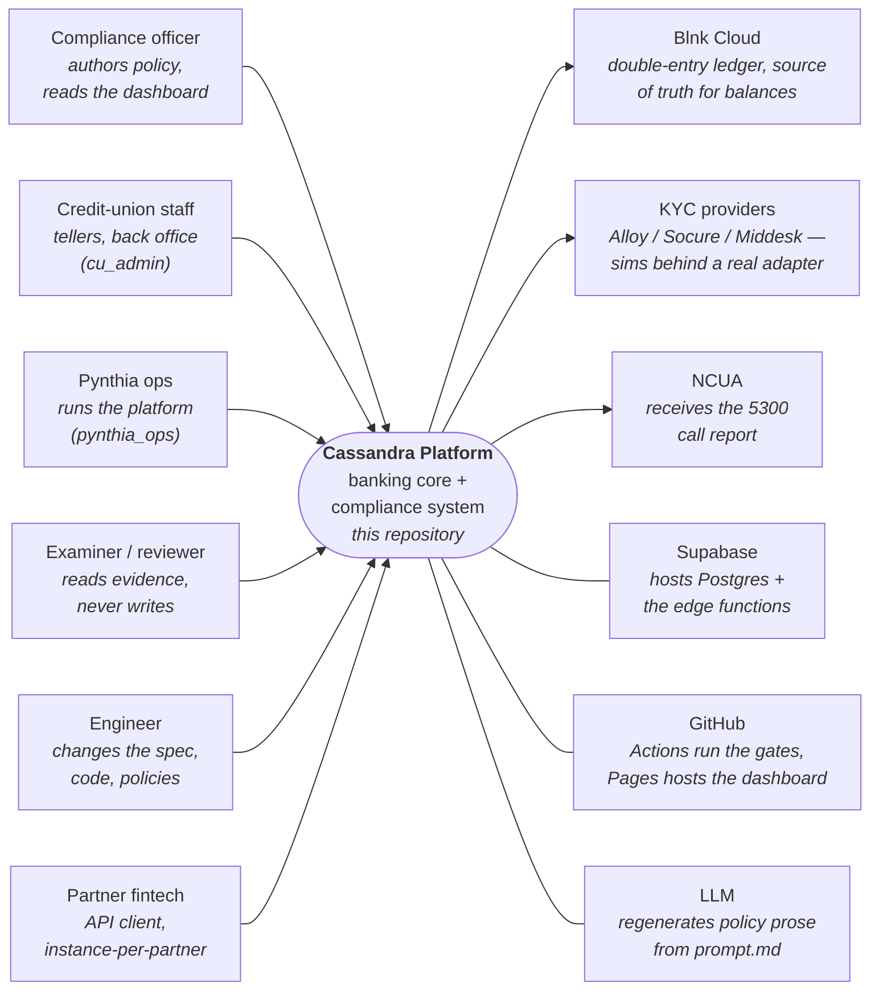

# Architecture — start here

A C4-style tour for humans: this page is the **system context** (who touches
the system and what it talks to), then
[containers.md](containers.md) (the deployable pieces),
[components.md](components.md) (inside the three big pieces), and
[walkthroughs.md](walkthroughs.md) (what actually happens when money moves, a
policy changes, or an endpoint changes — the three-domain flows).

Numbers deliberately do not live in these pages — they rot. The live counts
are generated into [STATE.md](../../STATE.md) on every rebuild.

## What this system is

**Cassandra Platform is a banking core for a credit union in which the
compliance policy and the running system are the same artifact.** A
compliance officer writes policy prose; controls are extracted from it
mechanically; those controls become database schema, a runtime gate on every
money movement, and tests that prove the gate fires. The other direction
also holds: the engineering spec (`core/core-api.yaml`) is the vocabulary
policies must use, so prose and system cannot disagree without a CI gate
going red.

Pynthia, the operating company, is a **narrow bank**: deposits and payments,
no lending (lending code exists but is deliberately unrouted — see
`core/supabase/functions/api/index.ts`). The operating model is
**banking-as-a-service**: each partner fintech gets its own isolated
instance, and one aggregator sees across them for settlement and compliance.

## System context

Three things this diagram cannot show, which are the point of the system:

1. **The gate is shared.** Every money rail (ACH, wires, cards, internal
   transfers, CDA) passes through one control engine, `runGate`, that reads
   the control catalogue extracted from policy prose. A control written once
   in a policy applies to every rail.
2. **Red is honest.** A control the code cannot yet enforce shows up red on
   the public dashboard, with the reason, instead of passing silently. The
   evidence tiers and their current green/red split are in
   [STATE.md](../../STATE.md).
3. **Everything derived is gated.** Route table, UI contract, verifier
   targets, vocabulary, crosswalk, dashboard — all generated from the spec
   and the policies by one ordered script (`scripts/rebuild_artifacts.sh`),
   with CI gates that fail when any copy drifts. Even these docs are gated:
   `scripts/check_doc_claims.py` fails the build if a hand-written page
   references a dead path or a stale number.

## The one rule to know before changing anything

**API changes start with the spec.** Do not add an endpoint, field, or event
by editing the implementation — declare it in `core/core-api.yaml`,
regenerate, then implement. The per-change-type workflow is in the repo
root's `CLAUDE.md`. The reason this rule exists (a three-way drift disaster
in July 2026) is written down there too.

## Where to go next

| you want to… | read |
|---|---|
| know what the deployable pieces are | [containers.md](containers.md) |
| find the code that does X | [components.md](components.md) |
| understand a cross-domain flow end to end | [walkthroughs.md](walkthroughs.md) |
| see current numbers (controls, tiers, targets) | [STATE.md](../../STATE.md) |
| make a change without breaking a gate | `CLAUDE.md` at the repo root |
| run the live demo | [demo-runbook.md](../demo-runbook.md) |
| understand why a design decision was made | `core/architecture-decisions.md` |
