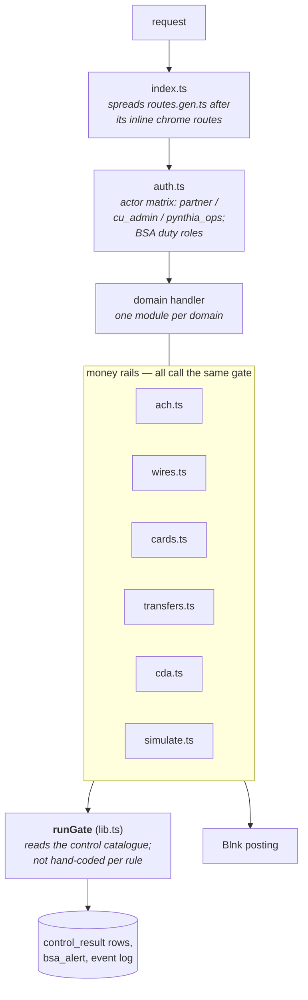
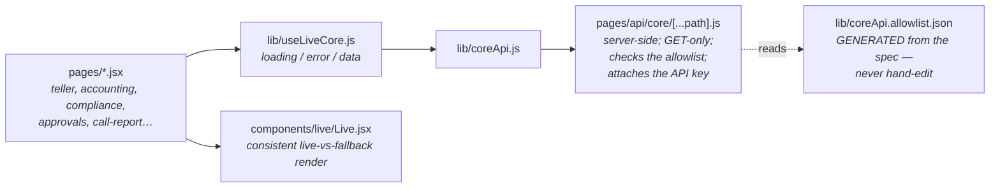
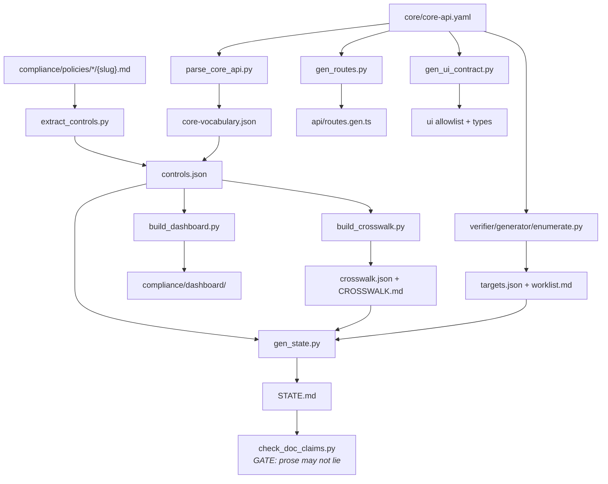

# Components — inside the big three

Level 3 of the [architecture tour](README.md): the internal structure of the
core API, the staff console, and the toolchain. This is the "where is the
code that does X" page.

## Core API (`core/supabase/functions/api/`)

One Deno function, one deployment, one `index.ts`. Compliance is not a
separate service — `bsa.ts` and `wires.ts` ship together and share the gate.

Component groups, and where to look:

| group | modules | notes |
|---|---|---|
| **routing & auth** | `index.ts`, `routes.gen.ts`, `auth.ts`, `lib.ts` | `routes.gen.ts` is generated from the spec; `lib.ts` holds `runGate` and shared plumbing |
| **money rails** | `ach.ts`, `wires.ts`, `cards.ts`, `transfers.ts`, `cda.ts`, `simulate.ts` | the only modules allowed to move value; each calls `runGate` |
| **compliance domains** | `bsa.ts`, `bsa_program.ts`, `privacy.ts`, `retention.ts`, `records_admin.ts`, `audit.ts`, `governance.ts`, `basel.ts`, `capital.ts`, `liquidity.ts`, `investment.ts`, `resolution.ts`, `risk_exceptions.ts`, `eps_controls.ts`, `member_protection.ts`, `complaints.ts`, `incidents.ts`, `ops_security.ts`, `ecommerce.ts`, `hr.ts` | roughly one module per policy domain; handlers write the evidence their controls demand |
| **entities & accounts** | `entities.ts`, `members` via `deposits_member.ts`, `accounts.ts`, `numbers.ts`, `ownership.ts`, `cash.ts`, `cash_ops.ts`, `eps.ts` | the nouns |
| **KYC** | `kyc.ts` | production-shaped adapter; Alloy/Socure/Middesk are deterministic simulations behind it |
| **read surfaces** | `dashboard.ts`, `events.ts`, `controls.ts`, `tail.ts`, `platform.ts`, `primitives.ts` | what the UI proxy and the dashboard redirect hit |
| **sandbox** | `sandbox.ts` | `/sandbox/reset` — destructive, demo-only |
| **deliberately unrouted** | `lending.ts`, `lending_underwriting.ts`, `collections.ts` | Pynthia is a narrow bank; handlers and tests stay, routes do not — do not route them without a product decision |

Sibling functions (same deployment platform, separate entry points):
`aggregator/` (cross-fintech, its own auth), `blnk-reconcile/` (scheduled
mirror sync, pg_cron → pg_net), `blnk-webhook/` (ledger callbacks),
`drill/` (the per-control test harness with `fake_db.ts` and `live_db.ts`
backends), `_shared/` (cross-function code).

## Staff console (`ui/src/`)

- Reaching a **new** endpoint from the UI starts in the spec: mark the
  operation `x-ui-surface: true`, run `python3 scripts/gen_ui_contract.py`.
  The workflow is in `ui/README.md` and `CLAUDE.md`.
- `lib/mock.js` survives only where the core has nothing to serve, and each
  mock documents the organizational fact it stands in for.
- A parallel proxy (`pages/api/blnk/[...path].js`) exists for ledger reads.

## Toolchain (`scripts/`, `core/verifier/`)

The ordered cascade is `scripts/rebuild_artifacts.sh` — the dependency order
lives there and nowhere else. Conceptually it is generators followed by
gates:

| kind | scripts | goes red when |
|---|---|---|
| **generators** | `parse_core_api.py`, `extract_controls.py`, `build_control_vocabulary.py`, `extract_vocab.py`, `build_crosswalk.py`, `build_dashboard.py`, `build_choreography.py`, `gen_routes.py`, `gen_ui_contract.py`, `gen_state.py`, `core/verifier/generator/enumerate.py` | never — they overwrite; drift shows up in the gates |
| **gates** | `check_route_parity.py`, `check_schema_parity.py`, `check_emitted_coverage.py`, `check_vocab_drift.py`, `check_vocab_refs.py`, `check_decision_refs.py`, `check_doc_claims.py` | an implementation, artifact, or document disagrees with the spec/policies |

The verifier (`core/verifier/`) enumerates black-box test targets from the
spec; its control tier is superseded by the drill, and its remaining value is
the contract/property/state-machine targets (see `core/README.md`).
