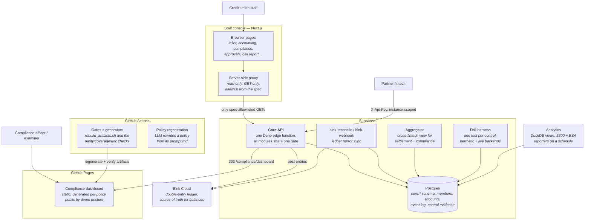

# Containers — the deployable pieces

Level 2 of the [architecture tour](README.md): what actually runs, where it
runs, and what talks to what. Components inside the big three are in
[components.md](components.md).

## The containers, one line each

| container | tech / where | responsibility | key paths |
|---|---|---|---|
| **Core API** | Deno edge function on Supabase | every endpoint; auth by actor class; the `runGate` control engine on all money rails | `core/supabase/functions/api/` |
| **Postgres** | Supabase | `core.*` schema generated from controls + spec; the event log; `control_result` evidence rows | `core/supabase/migrations/` |
| **Blnk ledger** | Blnk Cloud (external SaaS) | double-entry source of truth for balances; core keeps cached mirrors | `core/supabase/functions/blnk-reconcile/` |
| **Aggregator** | Deno edge function | the one cross-fintech view (instance-per-partner everywhere else) | `core/supabase/functions/aggregator/` |
| **Staff console** | Next.js (Pages Router) | staff screens; a **read-only server-side proxy** is the only path to the core, allowlisted from the spec | `ui/src/` |
| **Compliance dashboard** | static site, GitHub Pages | per-policy evidence pages + the money-movement-gate view + the choreography explorer, all generated | `compliance/dashboard/` |
| **Analytics** | DuckDB + shell, scheduled | event archive sweep, NCUA 5300 and BSA reporters | `analytics/` |
| **Policy corpus** | markdown + LLM workflow | one folder per policy: `prompt.md` (input) → `{slug}.md` (authored prose with control blocks) | `compliance/policies/` |
| **Drill harness** | Deno, two backends | fires every control's trigger, asserts its produced events — against a fake DB and against the real one | `core/supabase/functions/drill/` |
| **Toolchain + gates** | Python scripts, run by CI and humans | everything derived, and every check that keeps a copy honest | `scripts/`, `core/verifier/` |

## Trust boundaries worth knowing

- **The UI cannot write.** Its proxy is GET-only and path-allowlisted from
  the spec (`ui/src/lib/coreApi.allowlist.json`, generated). The core API key
  lives server-side and never reaches the browser.
- **Partners are instance-scoped.** `partner` actors see one instance;
  cross-instance visibility exists only in the aggregator (decision D23's
  access matrix, enforced in `core/supabase/functions/api/auth.ts`).
- **The dashboard is public on purpose** (demo posture). What keeps synthetic
  evidence from being mistaken for real is the `provenance` column on every
  evidence row — load-bearing, not decorative.
- **Non-partner routes 404 to outsiders.** Internal routes either declare
  `x-actors` in the spec or self-gate; a test pins the unauthenticated
  surface (`core/supabase/functions/api/route_gating.test.ts`).

## The CI workflows

| workflow | when | what it protects |
|---|---|---|
| `extract-artifacts.yml` | any input to the cascade changes | regenerates everything derived; auto-commits on main; PRs gate without committing |
| `doc-gate.yml` | every push and PR, no path filter | `STATE.md` current + hand-written docs' paths/numbers agree with the artifacts |
| `core-ci.yml` | core changes | the hermetic test suite |
| `ui-ci.yml` | ui/, spec, or generator changes | UI contract current + lint + build |
| `live-control-tier.yml` | weekly | re-runs every control against the **real** database; hermetic-green/live-red = fake-vs-real defect |
| `regenerate-policy.yml` | a policy's inputs change | LLM rewrite of that one policy, its row stamped in `STATUS.md` |
| `aggregator-reporters.yml` | daily | archive sweep, 5300 and BSA reporters |
| `pages.yml` | dashboard changes | publishes the dashboard without breaking its URL contract |
| `smoke.yml` | deploys | the deployed API answers |
