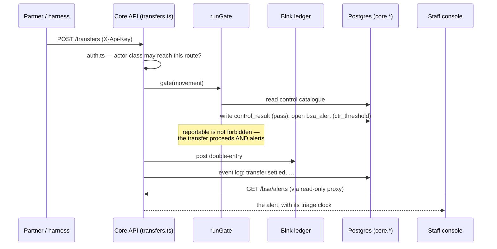
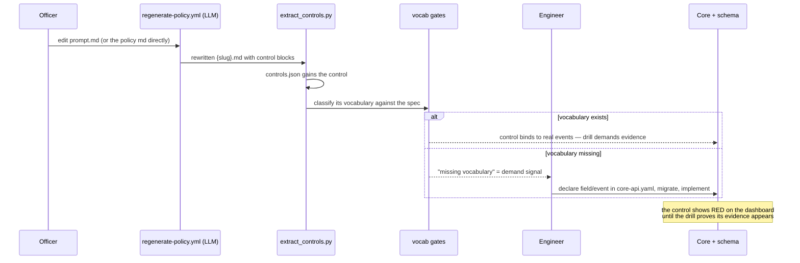
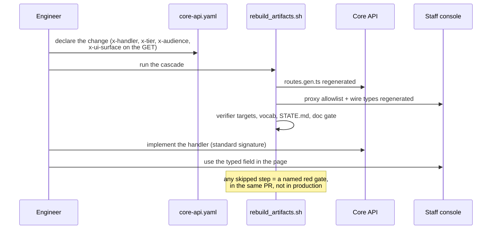

# Walkthroughs — the three cross-domain flows

The [context](README.md) and [container](containers.md) pages show structure.
This page shows motion: the three flows where UI, core, and compliance move
together — which is most of the work this repo will see.

## 1. A dollar moves (runtime)

What happens when a partner (or the demo harness) sends an $11,000 transfer.

Things this flow demonstrates that are easy to miss reading code:

- **The gate does not mean "block."** Most controls produce evidence and
  alerts; refusing is reserved for floors (e.g. the OFAC floor refuses a
  sanctioned name even under a full-trust partner attestation).
- **Every rail is the same story.** Replace `transfers.ts` with `ach.ts`,
  `wires.ts`, `cards.ts`, or `cda.ts` and the diagram is unchanged — that is
  the point of a shared gate.
- **The UI is a reader.** Staff see the alert because the proxy lets them
  read it, not because the UI participates in enforcement.

## 2. A policy changes (compliance → core → UI)

A compliance officer tightens a policy — say a new record-retention control.

The key mechanic: **a policy asking for something the core lacks does not
fail silently and does not block the policy** — it becomes a visible red
control plus a named vocabulary gap, which is the work queue for the core.
The reverse loop (`core/core-api-loop/`) then searches for the smallest spec
that satisfies the accumulated demand.

## 3. An endpoint changes (spec → core → UI → compliance)

An engineer adds a query parameter to an account listing and wants the staff
console to use it.

The order is the discipline: **spec first, generate, then implement.** Going
the other way (implement first) is what the parity gates exist to catch. The
full per-change-type recipe — endpoint, field, event, UI surface — is in
`CLAUDE.md` at the repo root.

## When something is red and you don't know why

| red thing | first place to look |
|---|---|
| a control on the dashboard | `red_by_reason` in `control-tests.json` — it names the missing writer or input |
| hermetic-green but live-red | `control-tests-live.json` `fake_vs_real_defects` — a real-database divergence |
| route parity / schema parity | the spec and the implementation disagree; fix whichever is lying, never the baseline |
| emitted coverage | the core emits an event code `x-events` never registered — register it in the spec first |
| doc claims | a hand-written doc references a dead path or stale number; fix the doc it names |
| UI contract check | someone hand-edited a generated file, or the spec changed under the UI — rerun `scripts/gen_ui_contract.py` |
